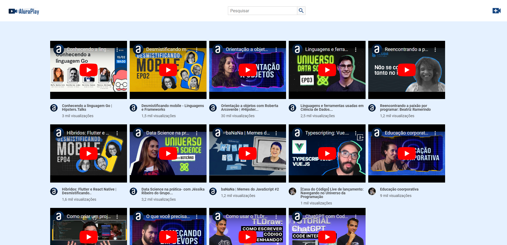
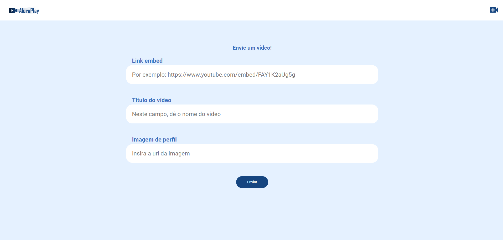

# Alura-Play
 
This is a solution to the [Alura - JavaScript: criando requisições](https://cursos.alura.com.br/course/javascript-criando-requisicoes). Alura Front-end school help you improve your coding skills by building realistic projects. 

## Table of contents

- [Overview](#overview)
  - [The challenge](#the-challenge)
  - [Screenshot](#screenshot)
  - [Links](#links)
- [My process](#my-process)
  - [Built with](#built-with)
  - [What I learned](#what-i-learned)
  - [Continued development](#continued-development)
  - [Useful resources](#useful-resources)
- [Author](#author)
- [Acknowledgments](#acknowledgments)

## Overview

This is the final project for Alura Play and its funcionalities.

### The challenge

Users should be able to:

- See a video display;
- Filter videos by search bar;
- Add new videos;

### Screenshot
#### Mobile

### Links

- Solution URL: [GitHub](https://github.com/ViniCellist/Alura-Play)

## My process

I created four JS files, for each a diferente function:

- `connectAPI.js` is responsible for connecting to API and export functions;
- `createVideo.js` is responsible to receive user information and add a new video to main page;
- `searchVideo.js` is responsible for filter user serach param;
- `showVideos.js` is the one whose shows at screen youtube videos stored in `db.json`.

### Built with

- Semantic HTML5 markup
- CSS custom properties
    - Flexbox
    - CSS Vars
- JavaScrip
- Node.js
- JSON

### What I learned

Another great project and expercience from creating so many functionalities.

### Continued development

I know for sure that this projects opened my mind to see webpage creation in a whole new perspective

### Useful resources

- [HTML 5](https://developer.mozilla.org/en-US/docs/Web) - HTML documentation.
- [CSS3](https://developer.mozilla.org/en-US/docs/Web/CSS) - CSS3 documentation.
- [JavaScript](https://developer.mozilla.org/pt-BR/docs/Web/JavaScript) - JS documentation
- [Node.js](https://nodejs.org/docs/latest/api/) - Node.js documentation
- [JSON](https://www.json.org/json-en.html) - JSON documentation

## Author

- GitHub - [Projects](https://github.com/ViniCellist)
- Frontend Mentor - [Profile](https://www.frontendmentor.io/profile/ViniCellist)
- LinkedIn - [Professional](hhttps://www.linkedin.com/in/vinicius-de-souza-duarte-57937b192/)
- Instagram - [Personal](https://www.instagram.com/vinicius_duartesd/)

## Acknowledgments

Honored mention goes to my mentor and teacher [Monica Hillman](https://github.com/MonicaHillman)!